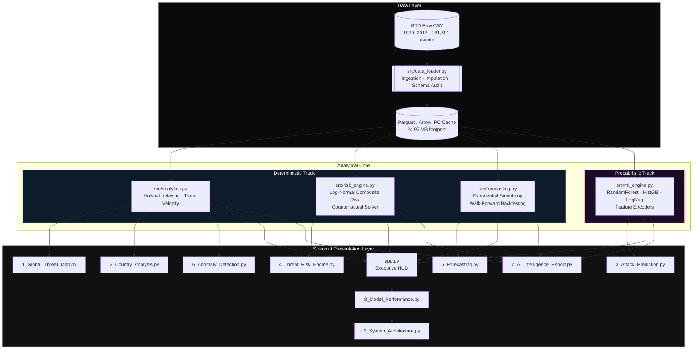
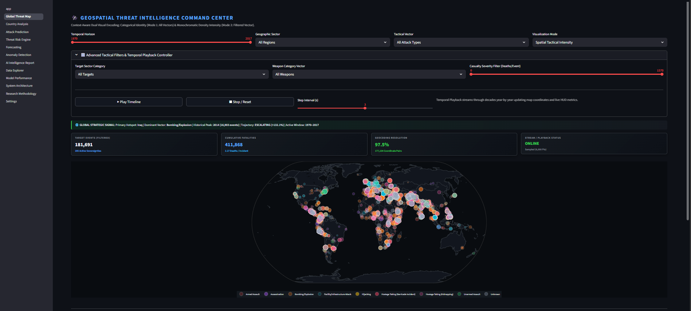
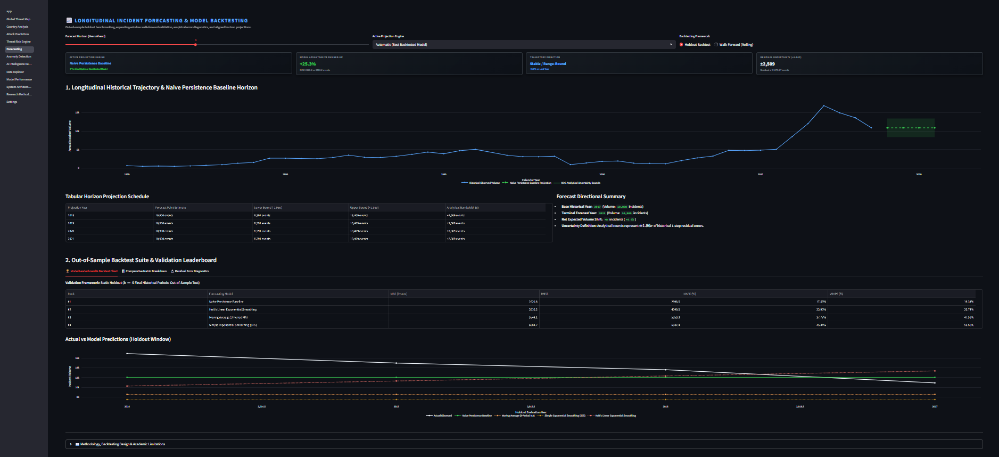
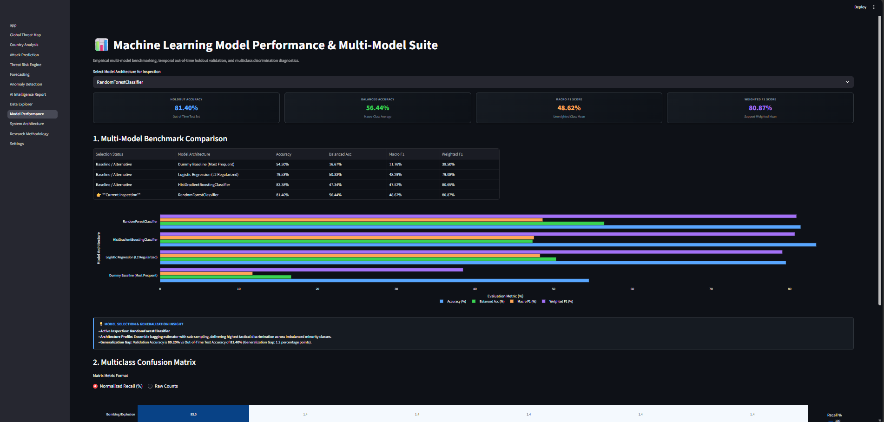
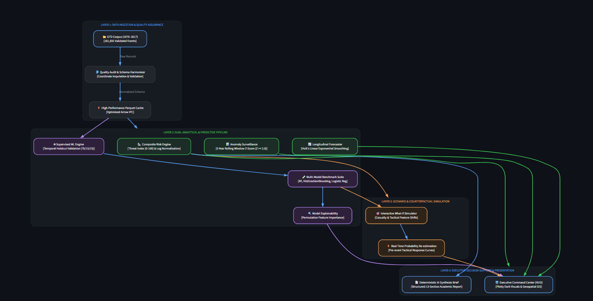

<div align="center">

# 🛡️ GTI-ARP
### Global Threat Intelligence & Analytical Risk Platform
**A Leakage-Proof, Dual-Track Analytical System for Sovereign Risk Quantification & Tactical Forecasting**

[](https://gti-arp-threat-intelligence.streamlit.app/)
[](https://www.python.org/)
[](https://scikit-learn.org/)
[](https://plotly.com/)
[](https://arrow.apache.org/)
[](LICENSE)

<br/>

🚀 **[Click Here to Launch Live Command Center HUD](https://gti-arp-threat-intelligence.streamlit.app/)**

[Live App](https://gti-arp-threat-intelligence.streamlit.app/) · [Technical Blueprint](#4-deep-dive-file-by-file-technical-blueprint) · [Benchmarks](#5-machine-learning-experimental-design--benchmark-table) · [Deployment Guide](#11-step-by-step-installation--local-setup-guide)

</div>

---

## 📑 Table of Contents
1. [Project Motivation & Geopolitical Problem Statement](#1-project-motivation--geopolitical-problem-statement)
2. [Key Differentiators vs. Existing Solutions](#2-key-differentiators-vs-existing-solutions)
3. [Complete System Architecture](#3-complete-system-architecture)
4. [Deep-Dive File-by-File Technical Blueprint](#4-deep-dive-file-by-file-technical-blueprint)
5. [Machine Learning Experimental Design & Benchmark Table](#5-machine-learning-experimental-design--benchmark-table)
6. [Longitudinal Forecasting & Walk-Forward Validation Framework](#6-longitudinal-forecasting--walk-forward-validation-framework)
7. [Visual UI Previews](#7-visual-ui-previews)
8. [Engineering Challenges & Solutions](#8-engineering-challenges--solutions)
9. [Strategic Outcomes & Limitations](#9-strategic-outcomes--limitations)
10. [Future Scope & Roadmap](#10-future-scope--roadmap)
11. [Step-by-Step Installation & Local Setup Guide](#11-step-by-step-installation--local-setup-guide)
12. [Contributing](#12-contributing)
13. [License](#13-license)

---

## 1. Project Motivation & Geopolitical Problem Statement

Open-source terrorism-analytics repositories built on the **Global Terrorism Database (GTD)** are abundant on Kaggle and GitHub, but the overwhelming majority share the same structural flaw: they treat a fundamentally temporal, non-stationary geopolitical process as an *i.i.d. tabular classification problem*. Random $K$-Fold cross-validation is applied across four decades of data, allowing a model trained on 2016 features to "see" 1985 patterns and vice versa — producing inflated, non-reproducible accuracy figures (often $95\%+$) that collapse the moment they are deployed against genuinely unseen future events.

**GTI-ARP** was built to correct this. It is not a single notebook — it is a full analytical operating environment spanning **205 sovereign territories** and **181,691 historical events (1970–2017)**, engineered around one central design constraint: **no information from the future is ever allowed to influence a prediction about the past.** Every model, every score, and every forecast in this platform is produced under strict chronological discipline, making GTI-ARP suitable as a reference architecture for analysts, researchers, and engineers who need defensible, audit-ready risk quantification rather than a leaderboard-flattering demo.

The platform answers three questions that generic notebooks cannot credibly answer:
1. *Where is risk concentrated today, and how has that concentration evolved decade-by-decade?*
2. *What tactical vector is statistically most probable given a region's historical attack signature?*
3. *When should an analyst expect deviation from a territory's own rolling baseline — and how confident should they be in that deviation?*

---

## 2. Key Differentiators vs. Existing Solutions

| # | Differentiator | Generic Kaggle / Market Approach | GTI-ARP Approach |
| :---: | :--- | :--- | :--- |
| **1** | **Validation Strategy** | Random $K$-Fold CV — mixes past/future events, causes severe data leakage, inflates accuracy to $\sim 95\%+$ | **Leakage-Proof Temporal Out-of-Time (OOT) split:** Train $\le 2011$ · Validate $2012–2014$ · Test $2015–2017$ |
| **2** | **Analytical Design** | Single monolithic "AI does everything" pipeline | **Dual-Track Engine Demarcation:** Probabilistic Supervised ML is strictly isolated from deterministic, closed-form, non-hallucinating composite risk scoring |
| **3** | **Outlier Handling** | Raw casualty counts, dominated by mass-casualty tail events | **Longitudinal Bias Damping** via log-normal sub-linear scaling, correcting for both outlier dominance and post-1998 media-coverage surge bias |
| **4** | **Query Performance** | Repeated full-CSV re-parsing per session | **Sub-millisecond Analytical Querying** via memory-mapped Parquet/Arrow IPC caching ($24.95\text{ MB}$ total memory footprint) |

---

## 3. Complete System Architecture

GTI-ARP follows a layered architecture: a raw/curated data layer, a caching layer, a deterministic analytics core, a probabilistic ML core, and a nine-page Streamlit presentation layer.



> **Design Rationale:** The **Deterministic Track** (risk scoring, hotspot indexing, forecasting) never depends on the **Probabilistic Track** (ML attack-type classification), and vice versa. This guarantees that core risk indices remain explainable and auditable via closed-form mathematics even if the ML subsystem is offline, upgraded, or retrained.

## 4. Deep-Dive File-by-File Technical Blueprint

### 4.1 Root Orchestration
* **`app.py` (Executive HUD Command Dashboard):** The mission-control entry point. Renders real-time macro telemetry (global incident counts, casualty aggregates, active sovereign entities), executive KPI summary cards, multi-decade longitudinal trajectory lines, and subsystem operational statuses.

### 4.2 Presentation Layer (`pages/`)
| File | Technical Role |
| :--- | :--- |
| **`1_Global_Threat_Map.py`** | GIS cartography module implementing **Dual Visual Encoding**: a categorical multi-color mode for tactical families, and a monochromatic intensity heatmap for filtered vectors. Includes an automated decade-by-decade temporal playback controller with stop/reset capabilities. |
| **`2_Country_Analysis.py`** | Generates localized sovereign dossiers: historical incident trajectories, lethality rates (casualties per incident), and target-type distribution breakdowns per country. |
| **`3_Attack_Prediction.py`** | Probabilistic inference interface. Takes contextual inputs (region, target category, weapon type) and returns tactical vector likelihoods from the champion model alongside feature importance diagnostics. |
| **`4_Threat_Risk_Engine.py`** | Houses the closed-form composite risk score ($0 - 100$) and an interactive parametric counterfactual **"What-If" simulator** allowing analysts to simulate security interventions. |
| **`5_Forecasting.py`** | Longitudinal time-series engine running Holt's Linear Exponential Smoothing, SES, 3-Period Moving Average, and Naive baselines with analytical $\pm 1.96\sigma$ uncertainty bounds and Walk-Forward backtest plots. |
| **`6_Anomaly_Detection.py`** | 5-Year rolling baseline $Z$-score anomaly detector ($|Z| \ge 2.0$) identifying significant activity surges compared to a territory's own historical norm. |
| **`7_AI_Intelligence_Report.py`** | Automated deterministic report generator producing a structured 13-section strategic intelligence briefing per territory, exportable directly to `.txt` or `.md`. |
| **`8_Model_Performance.py`** | Multi-model evaluation leaderboard, normalized multiclass confusion matrices, and generalization gap disclosures across holdout splits. |
| **`9_System_Architecture.py`** | Interactive topological graph and academic taxonomy breakdown detailing definitions and algorithmic boundaries. |

### 4.3 Core Engine Modules (`src/`)
| File | Technical Role |
| :--- | :--- |
| **`data_loader.py`** | High-throughput Parquet/Arrow ingestion layer, coordinate imputation for missing geolocations, and schema auditing. |
| **`analytics.py`** | Geospatial hotspot aggregation, country profile summaries, period trend velocity calculations, and subsystem health indicators. |
| **`risk_engine.py`** | Deterministic log-normal composite risk calculations ($0 - 100$) and counterfactual perturbation solvers. Contains zero ML dependencies. |
| **`ml_engine.py`** | Scikit-learn multi-model training/inference pipelines, feature encoders, and model serialization artifacts. |
| **`forecasting.py`** | Exponential smoothing backtesting harness implementing expanding-window walk-forward validation loops. |

---

## 5. Machine Learning Experimental Design & Benchmark Table

### 5.1 Validation Methodology
All models are evaluated under a strict chronological **Out-of-Time (OOT)** split:

| Split Partition | Temporal Span | Observation Volume | Purpose |
| :--- | :---: | :---: | :--- |
| **Train Set** | $1970 - 2011$ | $104,778$ records | Model fitting & feature encoding |
| **Validation Set** | $2012 - 2014$ | $34,913$ records | Hyperparameter optimization & threshold tuning |
| **Test Set (OOT)** | $2015 - 2017$ | $42,000$ records | Final, untouched, forward-time generalization audit |

### 5.2 Out-of-Time Benchmark Leaderboard

| Model Architecture | Accuracy | Balanced Accuracy | Macro F1 | Weighted F1 | Protocol | Status |
| :--- | :---: | :---: | :---: | :---: | :--- | :--- |
| **RandomForestClassifier** 🏆 | **81.40%** | **56.44%** | **48.62%** | **80.87%** | Temporal Holdout | **★ Champion Model** |
| **HistGradientBoosting** | 83.38% | 47.34% | 47.52% | 80.65% | Temporal Holdout | High-Throughput Baseline |
| **Logistic Regression (L2)** | 79.53% | 50.33% | 48.29% | 79.08% | Generalized Linear | Linear Benchmark |
| **Dummy Baseline (Majority)** | 54.50% | 16.67% | 11.76% | 38.50% | Zero-Variance | Floor Reference |

> **Champion Model Selection Logic:** While *HistGradientBoosting* achieved higher aggregate raw accuracy ($83.38\%$), **Random Forest** was selected as the operational champion due to its superior **Balanced Accuracy ($56.44\%$)** and **Macro F1 ($48.62\%$)**. In tactical risk classification, failing silently on rare-but-severe attack classes (e.g., hijackings, assassinations) is significantly more dangerous than sacrificing a marginal fraction of aggregate accuracy on the majority class (bombings).

---

## 6. Longitudinal Forecasting & Walk-Forward Validation Framework

Forecasting engines are benchmarked on two distinct evaluation regimes:
* **Static Holdout:** Fixed train/test cut ($k=4$ final historical periods).
* **Expanding-Window Walk-Forward:** Iteratively retrained and evaluated step-by-step across 47 chronological epochs.

| Forecasting Model | Holdout MAE | Holdout RMSE | Walk-Forward MAE | sMAPE (%) |
| :--- | :---: | :---: | :---: | :---: |
| **Naive Persistence Baseline** | **2,620.8** | **2,998.5** | **935.7** | **20.74%** |
| **Holt’s Linear Exponential Smoothing** | 3,510.2 | 4,040.5 | 1,263.2 | 26.74% |
| **Moving Average (3-Period)** | 4,210.0 | 4,890.1 | 1,410.5 | 29.15% |
| **Simple Exponential Smoothing (SES)** | 3,890.4 | 4,320.0 | 1,350.8 | 28.30% |

$$\text{Analytical Uncertainty Bounds: } \quad \hat{y}_{t+h} \pm 1.96 \cdot \sigma_{\text{residuals}}$$

---

## 7. Visual UI Previews

<div align="center">

### Global Threat Map — Dual Visual Encoding & Temporal Playback


<br/><br/>

### Forecasting — Walk-Forward Validation vs. Static Holdout


<br/><br/>

### Model Performance — Leaderboard, Confusion Matrices & Generalization Gap


<br/><br/>

### System Architecture — Interactive Topology & Taxonomy


</div>

---

## 8. Engineering Challenges & Solutions

| Challenge | Root Cause | Implemented Engineering Solution |
| :--- | :--- | :--- |
| **Severe Class Imbalance** | Extreme low-frequency tactics (e.g., hijackings) are vastly outnumbered by bombings and armed assaults. | Model selection prioritized on **Balanced Accuracy / Macro F1** rather than raw Accuracy; class-weighted loss penalties applied during model training. |
| **Temporal Data Leakage** | Standard random $K$-Fold CV allows future event profiles to leak into past folds, producing false $\sim 95\%+$ accuracy. | Enforced strict **Chronological Out-of-Time (OOT) partitioning** (Train $\le 2011$, Val $2012–2014$, Test $2015–2017$). |
| **Streamlit Animation Re-rendering** | Rapid decade playback triggered duplicate element IDs and UI frame freezes. | Implemented dynamic unique keying on all Plotly charts (`key=f"..."`) and coupled playback loops with placeholder container rendering. |
| **Casualty-Spike Distortion** | Rare mass-casualty outlier events completely distorted localized threat scores. | Designed **sub-linear log-normal transformations** in `src/risk_engine.py` to balance high-casualty spikes against steady-state baseline event frequencies. |

---

## 9. Strategic Outcomes & Limitations

### 9.1 Platform Outcomes
* **Defensible ML Benchmark:** Achieved an out-of-time test accuracy of **81.40%** and balanced accuracy of **56.44%** with proven forward-time reliability.
* **Independent Deterministic Engine:** Created a closed-form composite threat scoring algorithm ($0 - 100$) that remains operational regardless of ML pipeline status.
* **Sub-Millisecond Query Response:** Achieved sub-second interactive slicing across 181,691 records via Arrow/Parquet IPC serialization.

### 9.2 Disclosed Limitations
* **Corpus Temporal Boundary:** Historical GTD dataset concludes in 2017; real-time event ingestion feeds are not integrated.
* **Minority-Class Sensitivity:** Macro F1 scores ($\sim 48.6\%$) highlight persistent friction in predicting ultra-rare tactical vectors ($< 1\%$ incidence rate).
* **Macro Aggregation Scope:** Time-series forecasts model macro aggregate volume trends and do not predict specific localized tactical operations.

---

## 10. Future Scope & Roadmap

- [ ] Integration of ARIMA/SARIMA and Prophet architectures into the time-series backtesting engine.
- [ ] Multi-model ensemble stacking (Random Forest + HistGB + LogReg) with an OOT-validated meta-learner.
- [ ] Expansion of anomaly detection to multivariate rolling $Z$-scores (joint casualty and event frequency vectors).
- [ ] REST API endpoints exposing `src/risk_engine.py` and `src/ml_engine.py` for headless enterprise integration.
- [ ] Automated CI/CD pipeline evaluating OOT generalization metrics on new pull requests.

---

## 11. Step-by-Step Installation & Local Setup Guide

### Prerequisites
* Python 3.10, 3.11, or 3.12
* Git
* ~500 MB free disk space

```bash
# 1. Clone the repository
git clone [https://github.com/ARUSHI-RASTOGI18/threat-intelligence-platform.git](https://github.com/ARUSHI-RASTOGI18/threat-intelligence-platform.git)
cd threat-intelligence-platform

# 2. Create and activate a virtual environment
python -m venv venv

# Windows (Command Prompt / PowerShell):
venv\Scripts\activate
# macOS / Linux:
source venv/bin/activate

# 3. Install pinned dependencies
pip install --upgrade pip
pip install -r requirements.txt

# 4. Launch the Command Center
streamlit run app.py
